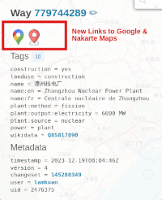

## Also check the bookmarklets page
[bookmarklets](bookmarklet.md)

# tampermonkey scripts for OSINT
This repository contains working [tamper-monkey](https://www.tampermonkey.net/) scripts to assist you in your OSINT investigations. Some are hosted directly on this repository, while others come from external sources.

## How to use these scripts
These script runs in the tamper-monkey browser addon. So to use them you need to install tamper-monkey in your browser. Then you can install the scripts from this repository just by clicking the install monkey script link.\
More info on the [tamper-monkey webiste](https://www.tampermonkey.net/).

## Scripts:
*SH*: Self-Hosted\
*UP*: Auto-Update

| Site | Name | SH | UP | Cat |
|------|------|-------------|-------------|-----|
| [facecheck.id](https://facecheck.id)              | [facecheck-url-extractor](#facecheck-url-extractor) |   |   | Images |
| [overpass-turbo.eu](https://overpass-turbo.eu)    | [overpass-turbo-google-nakarte](#overpass-turbo.eu)    | X | X | GIS |
|                                                   |                                                     |   |   |      |

## facecheck.id
### facecheck-url-extractor
**[install](https://github.com/vin3110/facecheck.id-results-extractor/raw/refs/heads/main/facecheck-url-extractor-desktop&mobile.user.js)**\
This script, provided by vin3110, extracts URLs from images on [facecheck.id](https://facecheck.id).

## overpass-turbo.eu
### overpass-turbo-google-nakarte
**[install](https://raw.githubusercontent.com/markcla16/tampermonkey-scripts/main/tampermonkey-scripts/overpass-turbo-google-nakarte.user.js)**\
This script provide **links to Google maps & Nakarte maps** in the popup window that appear when you click on a node or way on the [Overpass Turbo](https://overpass-turbo.eu/) website.

